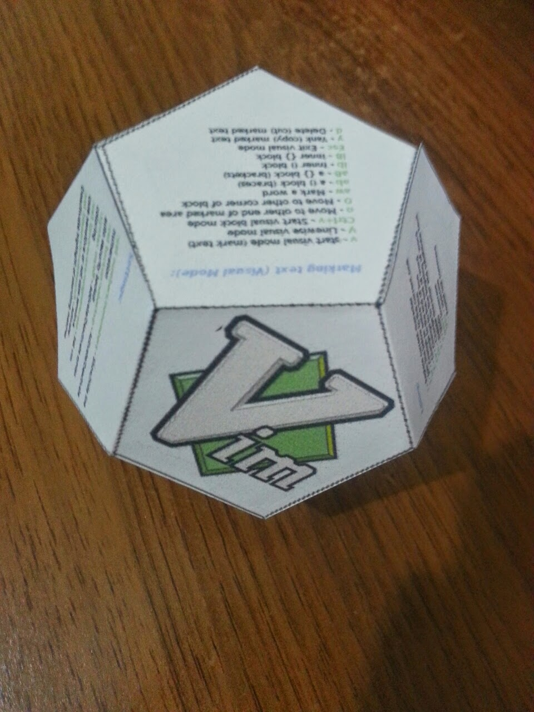

# VIM Cheat Ball

Use the [`cheat_ball.pdf` file](./cheat_ball.pdf)

## License

This resource is licensed under the Creative Commons Attribution-ShareAlike 4.0
International license.

By: Daniel Campoverde [Alx741]

mailto: alx@sillybytes.net

https://sillybytes.net
